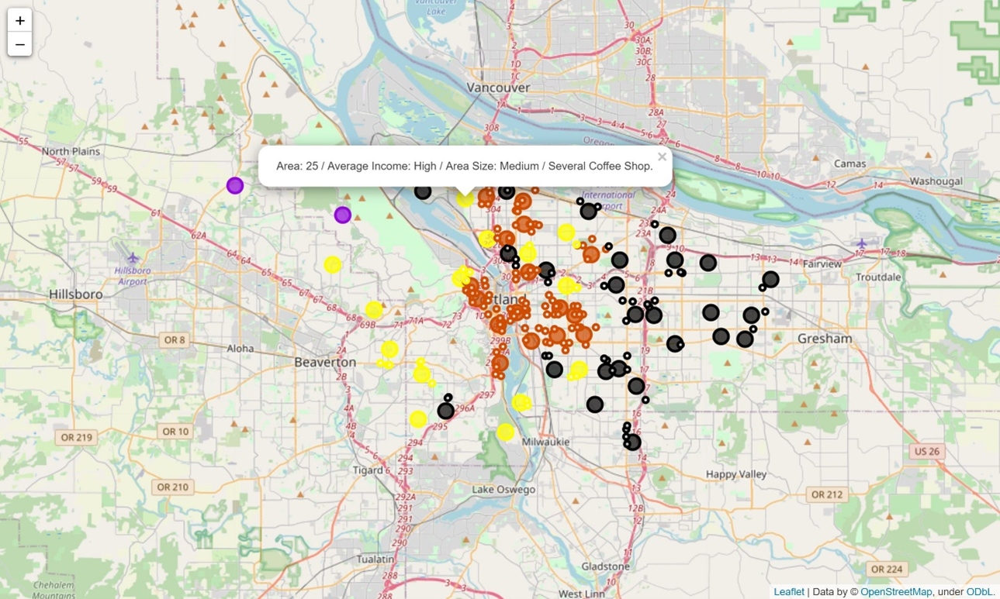

# Coursera_Capstone
### Analyzing coffee shops in Portland, Oregon
Leverage the Foursquare location data to analyzing and clustering an area in Portland to scope down the point of interest for a place to opening new coffee shops.

## Introduction

Opening a coffee shop is a dream business for many people because it is a business that can make highly profitable, just making a great coffee. While a great coffee is the heart of the business, the location of the shop is also the most important thing to consider too. Because if choosing the wrong location, in other words, choose a location that is not the target group, or a location in an area with a lot of competitors, this may cause the sales will not meet the target.

So, if someone considers opening a coffee shop, what type of place will be a good location to start a business? By looking on the plain map, it is hard to say where is the good place to be setting up a shop. On the other hand, it will be great if we can have this information combined with a map of a city or a location of interest. The main goal of this project will be exploring the coffee shops in Portland, Oregon, and combine with key indicators of each area, to extract some insights so people that want to open a new coffee shop can scope down the point of interest and made them make a decision easier.

This project will be useful to someone who considers opening a coffee shop. People who like to visit the coffee shops may also interest, or someone that would like to open the other type of venue like a restaurant, just adapt a few feature or process to the related field.

## Data

The main dataset used in the project is the [US Household Income Statistics from Golden Oak Research Group](https://www.kaggle.com/goldenoakresearch/us-household-income-stats-geo-locations). The database contains about 32,000 records on US Household Income Statistics & Geo Locations. A full description of the dataset can be found on [Kaggle’s website](https://www.kaggle.com/goldenoakresearch/us-household-income-stats-geo-locations).

Information about all venues including venue identification, names, their coordinates, distance from the defined coordinates, and categories obtained by passing the required parameters to the Foursquare API including the coordinates from the main dataset, credentials, API version, radius around the defined coordinates and limit of the results.

## More

For more details on the project, see ...

- [Code](https://github.com/Pannakwt/Coursera_Capstone/blob/master/code.ipynb) - Source code with details.
- [Report](https://github.com/Pannakwt/Coursera_Capstone/blob/master/full_report.pdf) - Methodology, Results, Discussion, and Conclusion.
- [Presentation](https://github.com/Pannakwt/Coursera_Capstone/blob/master/presentation.pdf) - Full details of the project, in shorten version.